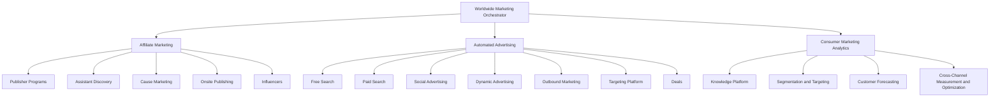

# Team Chart

## Portable capability interpretation

The specialist roles are portable and usable beyond any single company:

- **Assistant Discovery** covers assistant-led, browser, voice, and AI-agent discovery surfaces.
- **Cause Marketing** covers purpose-led, charitable, community, and trust programs.
- **Publisher Programs** covers affiliate and publisher programs.
- **Knowledge Platform** is the shared vocabulary, documentation, lineage, and institutional-memory layer.
- **Cross-Channel Measurement and Optimization** is the independent evidence and acceptance layer.
